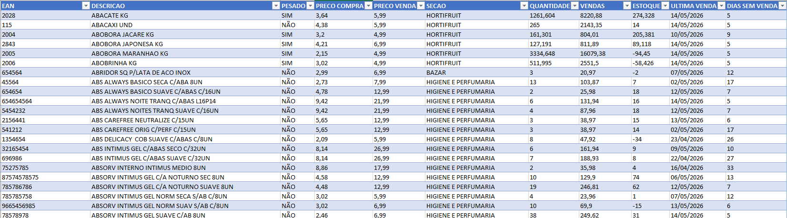
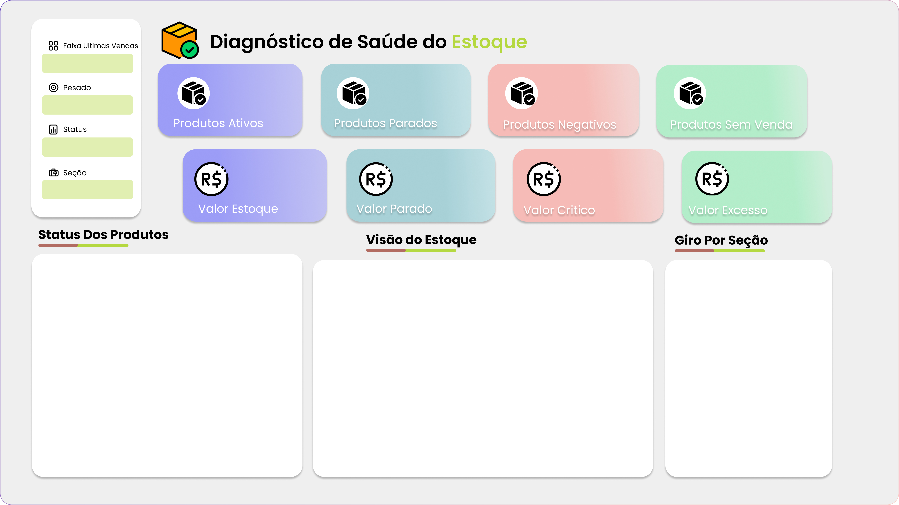
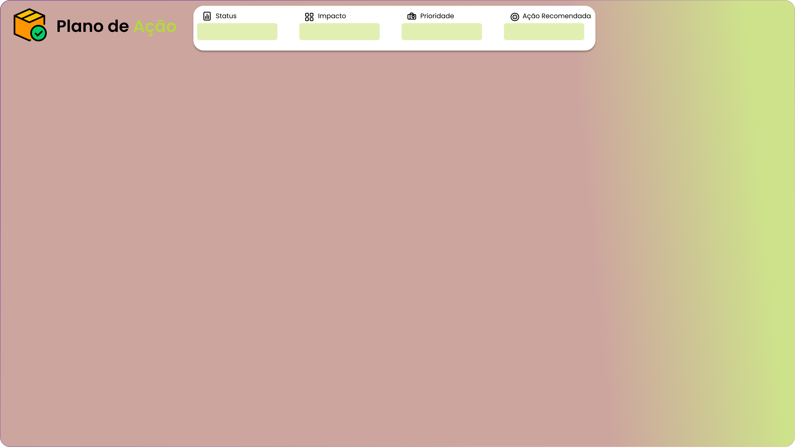
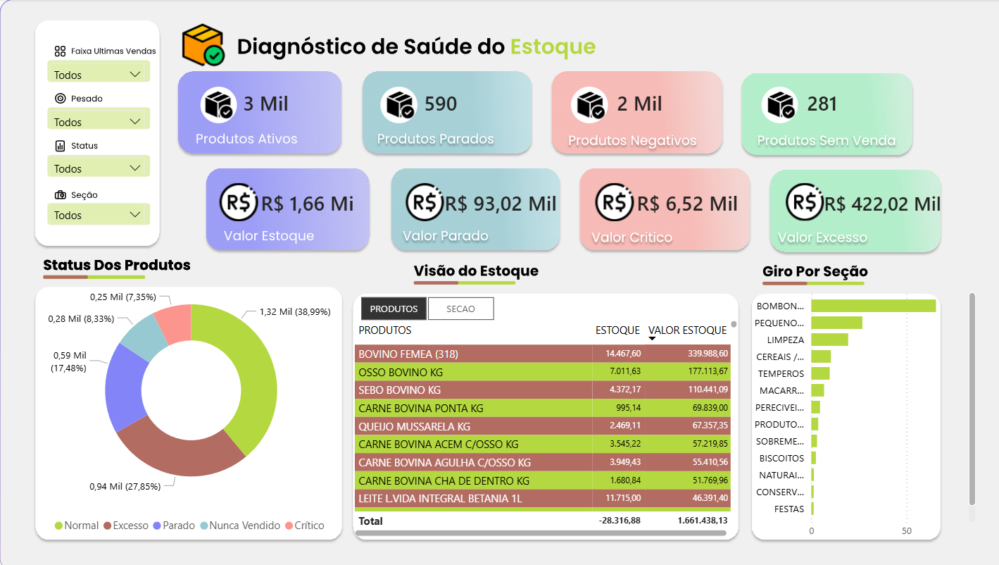
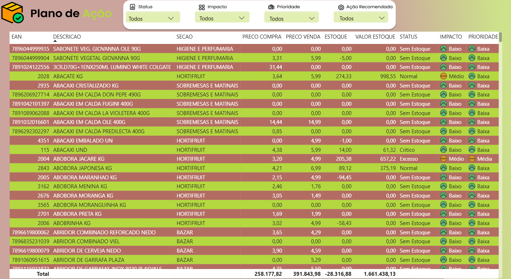

# Diagnóstico de Saúde do Estoque e Plano de Ação para Supermercado
---
## Sobre o Projeto 📌

Este projeto apresenta uma análise diagnóstica e prescritiva do estoque de um supermercado, desenvolvida para apoiar a gestão operacional e auxiliar na tomada de decisão sobre produtos críticos, excesso de estoque, itens parados e oportunidades de reposição. Diferente dos relatórios tradicionais encontrados em sistemas ERP, que normalmente apresentam apenas entradas, saídas e saldo atual, esta análise foi construída de forma personalizada para identificar o estado de saúde do estoque, classificar produtos conforme risco operacional e gerar ações recomendadas para cada cenário encontrado.

Para preservar a confidencialidade da loja, o nome da empresa não foi divulgado e os arquivos desse repositório apresentam dados reduzidos, porém na analise foram utilizados todo o necessário.

## Objetivo 🎯

Construir uma solução analítica capaz de transformar dados operacionais do estoque em informações estratégicas, permitindo identificar:

✅ Produtos com excesso de estoque  
✅ Produtos críticos para reposição  
✅ Itens sem movimentação recente  
✅ Produtos nunca vendidos  
✅ Estoques negativos  
✅ Itens parados com alto impacto financeiro  
✅ Definição de prioridade operacional  
✅ Sugestão automática de ações

O projeto foi dividido em duas frentes principais:

1. Diagnóstico da Saúde do Estoque | Visão geral da situação operacional do estoque.
2. Plano de Ação | Definição de impacto, prioridade e recomendação para cada produto.

## Tecnologias Utilizadas 🛠

- SQL Server
- Excel
- Power BI
- DAX
- Figma

## Abordagem 🔍

O projeto seguiu um fluxo completo de extração, tratamento e análise:

SQL Server → Extração SQL → Excel → Power BI → DAX → Dashboard Analítico → Plano de Ação

### - Etapas de Extração

Os dados foram extraídos diretamente do banco SQL Server utilizado pelo ERP do cliente, foram criadas duas bases:

- Estoque Vendas 90 Dias  
Base responsável por analisar produtos que tiveram movimentação recente.

- Estoque Todos Produtos  
Base responsável para mapear todo o estoque da loja, incluindo produtos sem venda recente ou nunca vendidos.

Segue abaixo o select utilizado para extrair as informações das vendas e do estoque dos ultimos 90 dias.

```bash
SELECT 
    o.ean,
    o.descricao,
    o.pesado,
	REPLACE(CAST(p.precocompra AS VARCHAR),'.',',') AS precocompra,
    REPLACE(CAST(p.precovarejo AS VARCHAR),'.',',') AS precovarejo,
    se.descricao AS seção,
    REPLACE(CAST(SUM(c.quantidade) AS VARCHAR),'.',',') AS quantidade,
    REPLACE(CAST(SUM(c.totalliquido) AS VARCHAR),'.',',') AS faturamento,
    REPLACE(CAST(e.estoquefinal AS VARCHAR),'.',',') AS estoque,
    ISNULL(
        CONVERT(VARCHAR, uv.ultima_venda, 103),
        'Nunca Vendido'
    ) AS ultima_venda,
    CASE
        WHEN uv.ultima_venda IS NULL
        THEN 'Nunca Vendido'
        ELSE CAST(
            DATEDIFF(
                DAY,
                uv.ultima_venda,
                GETDATE()
            ) AS VARCHAR
        )
    END AS dias_sem_venda
FROM erp_produtos o

INNER JOIN erp_precos p
ON o.id = p.produto

INNER JOIN erp_produtos_estoque e
ON o.id = e.produto

INNER JOIN erp_subfamilias s
ON s.id = o.subfamilia

INNER JOIN erp_secoes se
ON se.id = s.secao

INNER JOIN pdv_cupom_produtos c
ON c.ean = o.ean

LEFT JOIN (
    SELECT
        ean,
        MAX(datacupom) AS ultima_venda
    FROM pdv_cupom_produtos
    WHERE cancelado = 0
    GROUP BY ean
) uv
ON uv.ean = o.ean

WHERE
p.filial = 1

AND c.datacupom <= '2026-05-14'

AND c.datacupom >= '2026-02-13'

AND c.cancelado = 0

GROUP BY

o.ean,
o.descricao,
o.pesado,
p.precocompra,
p.precovarejo,
se.descricao,
e.estoquefinal,
uv.ultima_venda

ORDER BY o.descricao asc
```


## - Criação do Dashboard

Após a etapa de extração, os dados foram organizados e exportados para planilhas em excel. Em seguida, as bases foram importadas para o Power BI, onde foi realizada a modelagem dos dados, normalização com power query, criação de colunas calculadas e desenvolvimento de medidas DAX para construção dos indicadores analíticos.

o layout visual foi construído no Figma com o objetivo de criar uma interface mais intuitiva e executiva, segue abaixo a estrutura:



A primeira página apresenta uma visão consolidada da saúde do estoque, com a primeira linha trazendo indicadores operacionais e a segunda com indicadores financeiros, sendo o diferencial dessa análise o gráfico dos status dos produtos.



A segunda página foi construída com foco prescritivo, esta abordagem transforma a análise em um instrumento operacional para apoio à decisão. Cada produto recebeu classificações automáticas:

> Status

- Normal
- Crítico
- Excesso
- Sem estoque
- Parado
- Nunca vendido

> Impacto

- Baixo
- Médio
- Alto

> Prioridade

- Baixa
- Média
- Alta

> Ações recomendadas

- Reposição
- Monitorar
- Reduzir compras
- Promoção
- Sem ação



## Principais Descobertas 🚀

### - Alto volume de produtos parados

Foi identificado um número expressivo de itens sem movimentação recente. Impactos:

- capital imobilizado
- baixa eficiência operacional
- aumento do custo de armazenagem

### - Existência de estoque negativo

Diversos produtos apresentaram saldo negativo. Possíveis causas:

- falhas de inventário
- divergência operacional
- perdas não registradas
- inconsistências no ERP

### - Excesso de produtos com baixa rotatividade

Itens com pouca saída apresentaram volumes elevados. Indícios:

- compras acima da demanda
- ausência de curva de giro
- reposição não baseada em consumo

## Propostas sugeridas 💡

### - Gestão de itens parados

Criar campanhas específicas para:

- produtos sem venda
- itens esquecidos
- estoque envelhecido

### - Controle de estoque negativo

Realizar:

- auditoria de inventário
- conferência operacional
- revisão cadastral
- validação de movimentações

### - Revisão do processo de compras

- Utilizar indicadores de giro e cobertura para definir novas reposições, para assim transformar compras reativas em compras orientadas por dados.
